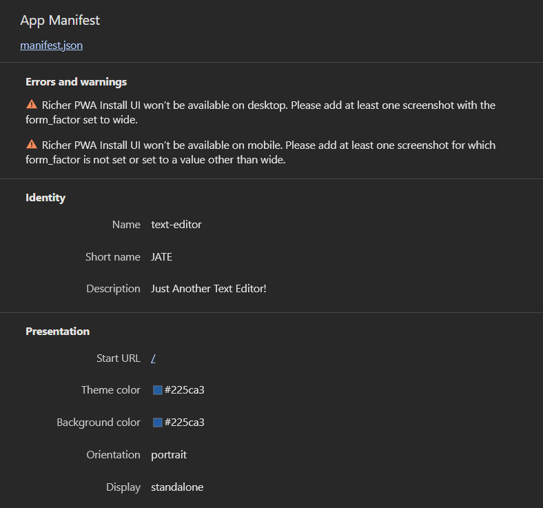
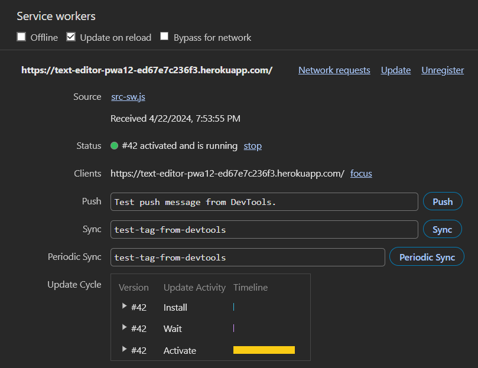
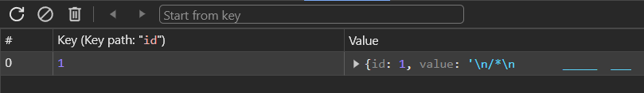

# (PWA)-Text-Editor

## Overview

## Table of Contents
- [Overview](#overview)
- [Getting Started](#getting-started)
- [Features](#features)
- [Contributing](#contributing)
- [License](#license)
- [Questions](#questions)

## Getting Started

## Features

## Contributing
Thank you for considering contributing to our project! Follow these steps:

* Fork the repository and clone it to your local machine.
* Create a branch, make your changes, and commit them with a clear message.
* Push your changes to your forked repository.
* Open a pull request on the original repository.

Guidelines
* Follow existing code style and conventions.
* Ensure your code is well-documented.

Pull Requests
* Keep them focused and provide a clear description.
* Reference relevant issues if applicable.

## License

This project is not licensed and is provided as-is without any warranty. You are free to use, modify, and distribute the code as you see fit. However, we do not provide any legal protection or support for this project.

## Questions
For questions about this project, contact [Parker Rappleye](https://github.com/prappleman) via email at parker.rappleye1@gmail.com.
