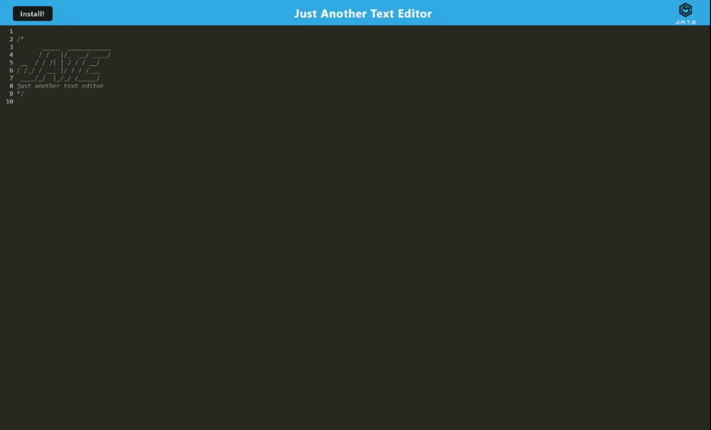

# (PWA)-Text-Editor

## Overview
This is a text editor web application designed to provide a seamless experience for writing and saving content. The application utilizes modern web technologies such as IndexedDB for local database storage, webpack for bundling JavaScript files, and workbox for service worker registration. It aims to offer a user-friendly interface while incorporating efficient backend and frontend functionalities.

  
  
  
  

## Table of Contents
- [Overview](#overview)
- [Getting Started](#getting-started)
- [Features](#features)
- [Contributing](#contributing)
- [License](#license)
- [Questions](#questions)

## Getting Started
To get started with the text editor web application, simply [click here](https://text-editor-pwa12-ed67e7c236f3.herokuapp.com) to access the live version hosted on Heroku.

## Features
- **Client-Server Architecture**: Organized folder structure for managing client and server-side code.
- **Automatic Backend Startup**: Running `npm run start` initiates the backend and serves the client.
- **Webpack Bundling**: JavaScript files are bundled using webpack for optimized performance.
- **Generated HTML, Service Worker, and Manifest Files**: Webpack plugins generate essential files for progressive web app functionality.
- **Next-Gen JavaScript Support**: The application seamlessly functions with modern JavaScript features.
- **IndexedDB Integration**: Immediate database storage creation for saving and retrieving content.
- **Offline Support**: Service workers and workbox ensure functionality even when offline.
- **Installable Web Application**: Users can download the web app as an icon on their desktop for easy access.
- **Render Deployment**: Build scripts are provided for deploying the application to Render.

## Contributing
Thank you for considering contributing to our project! Follow these steps:

* Fork the repository and clone it to your local machine.
* Create a branch, make your changes, and commit them with a clear message.
* Push your changes to your forked repository.
* Open a pull request on the original repository.

Guidelines
* Follow existing code style and conventions.
* Ensure your code is well-documented.

Pull Requests
* Keep them focused and provide a clear description.
* Reference relevant issues if applicable.

## License

This project is not licensed and is provided as-is without any warranty. You are free to use, modify, and distribute the code as you see fit. However, we do not provide any legal protection or support for this project.

## Questions
For questions about this project, contact [Parker Rappleye](https://github.com/prappleman) via email at parker.rappleye1@gmail.com.
